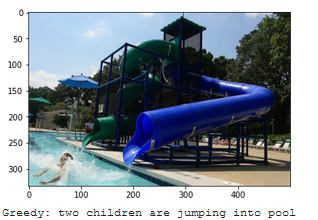

# PROJEKT BADAWCZY
## Generowanie słownego opisu obrazu
## Bany Maciej, Krupińska Izabela
## Wstęp
Projekt badawczy opierał się na słowym opisie obrazów.
Do trenowania i testowania użyliśmy zbioru flickr8k. 
Opisy są generowane na podstawie korzystania z wyuczonego modelu.
Model składa się z dwóch części. Informacje z obrazu oraz opisu obrazu.
Kolejną częścią naszych badań było przetłumacznie podpisów zbioru na język polski z wykorzystaniem Azure. 
Następnie wytrenowaliśmy model z polskimi podpisami.

### Wykonane zadania
#### Wyodrębnienie cech obrazu

#### Definiowanie cech tekstu

#### Trenowanie modelu

#### Generator napisów

#### Tłumaczenie zbioru na język polski

#### Trenowanie nowego zbioru

## Wyniki
Nasze wyniki sprawdzaliśmy za pomocą miar BOW, BLEU, CIDER.
Wyniki zostały porównane dla zbiorów trenujących i testujących zbioru danych w języku angielskim i polskim.
Szczegóły wyników zostały zawarte w plikach WYNIKI.
Poniżej otrzymany wynik dla zbioru danych w języku angielskim.

 

## Źródło
https://paperswithcode.com/paper/deep-visual-semantic-alignments-for 
https://arxiv.org/abs/1412.2306
https://hub.packtpub.com/generating-automated-image-captions-using-nlp-and-computer-vision-tutorial/
https://towardsdatascience.com/image-captioning-with-keras-teaching-computers-to-describe-pictures-c88a46a311b8
https://machinelearningmastery.com/develop-a-deep-learning-caption-generation-model-in-python/
